## Basic processing of Landsat data with R ##

### Overview ###

In this lecture you will learn the basic handling of Landsat data (as one example of multispectral satellite data). The learned processing steps include:

- Loading Landsat data
- Visualizing Landsat data
- Clipping Landsat data with a Shapefile
- Masking Landsat data
- Calculating Vegetation indices
- Unsupervised classification of Landsat data  

The datasets applied in this tutorial are available here:

[https://drive.google.com/open?id=1goGeRNGYaMSUBR7st7SOQ5P7GqxQPmP6](https://drive.google.com/open?id=1goGeRNGYaMSUBR7st7SOQ5P7GqxQPmP6)

### Datasets used in this Tutorial ###

In this tutorial we will use two Landsat-8 scenes. To be more precise, we will make use of the Landsat 8 surface reflectance product which can be downloaded from the USGS earth explorer webpage [https://earthexplorer.usgs.gov/](https://earthexplorer.usgs.gov/) .
How to download the corresponding images will be demonstrated in the course.

Detailed information about the structure of the datasets can be found here: [https://ilias.studium.kit.edu/goto.php?target=file_895949_download&client_id=produktiv](https://ilias.studium.kit.edu/goto.php?target=file_895949_download&client_id=produktiv "Landsat 8 product guide")

It is highly recommended to read this document before working with the Landsat 8 reflectance product data. A corresponding document for the Landsat 4-7 reflectance products (which will be used in the course at a later stage) can be found here: [https://ilias.studium.kit.edu/goto.php?target=file_895950_download&client_id=produktiv](https://ilias.studium.kit.edu/goto.php?target=file_895950_download&client_id=produktiv)  

### Step 1: Loading Landsat data ###

As first step, load all necessary R packages by executing the following code:

    pkgs<-c("rgdal","caret","raster","foreign", "kernlab", "colorRamps", "landsat")
	lapply(pkgs,require, character.only=T)

R will give you a warning message in case a package is not installed yet. If this is the case, please install the packages either through the main menu of Rstudio by selecting **"Tools" =>** **"Install packages"** and then following the appearing dialogue, or by entering the corresponding R code to install the packages into the console. E.g., to install the package "raster" use the code:

	install.packages("raster")	

After all packages are successfully installed, load the images using two steps. First, save the complete file-paths of all Landsat bands into a text-variable using the command:

	bandnames <- list.files("D:/remote_sensing/Landsat/D239", pattern="\\.tif$", full.names = T)

The file-path given in the code above should be changed to match the path where you are storing the corresponding files on your computer. Next, apply the "stack" command of the raster package to load the image into an R raster object:

	ls_d239 <- stack(bandnames)
	
The stack command does not yet load the whole dataset into the memory but just reads the meta-data of the file and establishes links to the data on the hard drive. Finally, run the variable name to obtain a summary of the raster file:

	ls_d239

This should give you a console-output like this:

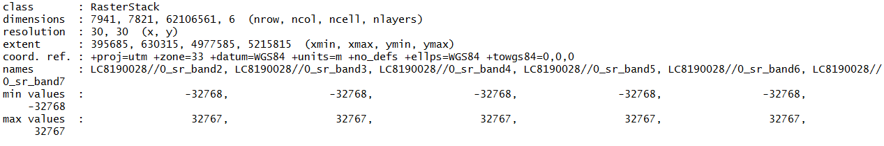

The displayed information tells you mostly something about the meta-data of the raster file.

Be aware that this procedure of loading a Landsat image will only work if the downloaded Landsat reflectance product has already been extracted from the compressed file and relevant GeoTiff-files containing the spectral information of the individual bands were stored into a separate folder. In our case, the folder **D239** contains the following folders and files:

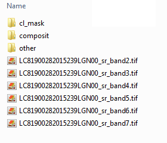

On the lowest level, all relevant bands for the Landsat 8 scene are stored (*band2 - *band7.tif), in the folder **"cl_mask"**, a tif-file containing the results of the fmask-cloud masking algorithm that is applied during the creation of the Landsat-8 reflectance product is stores. The **"other"** folder contains the the *band.tif file which is not applied here, as it mostly serves for the atmospheric correction. The **"composit"** folder is currently empty but will be used to save a new tif-file which contains all the 6 considered Landsat-bands in a single file. This folder structure was created manually in the given case to ease the handling of the data in the tutorial. Be aware that you will have to conduct these steps yourself once you are working with your own datasets.

### Step 2:  Visualizing Landsat data ###

After loading the Landsat scene, we would like to have a first glance how the image looks like. There are two basic options for plotting the satellite scene in R. The first option uses the code:

	plot(ls_d239)

With this code, all bands of the satellite scene will be individually plotted next to each other in a matrix of plots as shown below. 

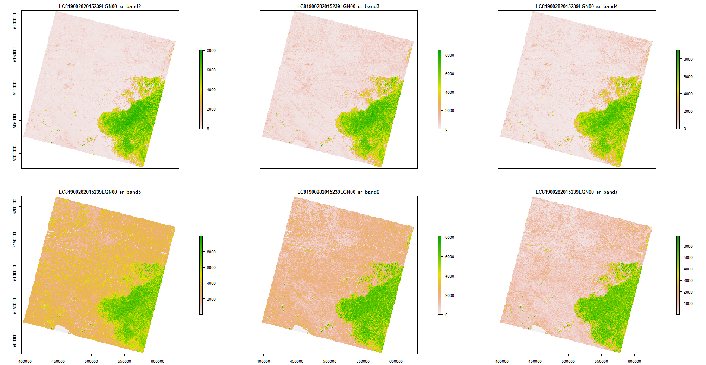

In some cases, executing the above code may result in an error message that the margins are too small to plot the data. The solution to this problem is to first open a pop-up plotting window in R and then execute the plot commant. This works by using the following code.

	x11()
	plot(ls_d239)

While this plot gives us some information about how the individual bands of the satellite scene look like, they are still somehow disappointing, as we normally would prefer to see a true-color-visualization of the satellite scene. That is, a visualization that imitates the impression that we create with our visual perception.

For such a plot we need a different plotting command which is provided by the *raster* package:

	plotRGB(ls_d239, r=3, g=2, b=1, stretch="hist")

The plotRGB command requires several settings as seen in the code. The first variable is the image to be plotted. Then we have to define which bands of the image should be plotted as the three available colors r = red, g = green, b = blue. In our case, we assign the correct Landsat bands to the the corresponding visualization colors. That is, we assign the Landsat band collecting information about light in the red portion of the spectrum to the red visualization, the green Landsat channel to the green visualization and the blue Landsat channel to the blue visualization. Finally, we have to define a method for stretching the image (pixel) values to the available visualization range. In our case we tell the plotting command to use a histogram ("hist") created by a representative sample of pixels of the image to automatically find a suitable stretch-setting. More detailed information about the plotRGB command can be obtained using the help-function of R which can be accessed for the plotRGB command using.

	?plotRGB

Running the command with these settings will result in an image as shown below. This image more or less matches our visual perception (that is, what we would see when we would fly across this area with an airplane or a space rocket and the atmosphere would be very clear). 

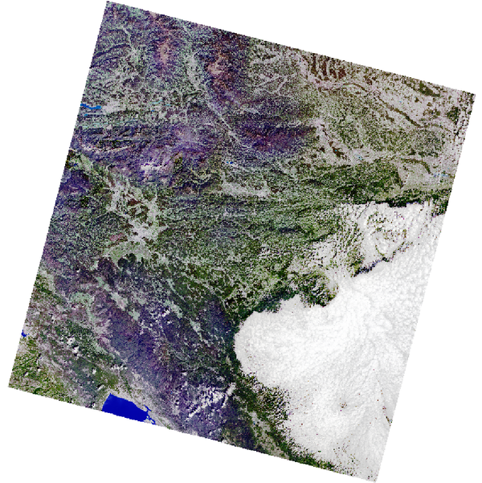

Such images can directly be interpreted - green areas typically refer to vegetation, blue areas to water and the white areas to snow or in this case clouds.

While these settings are great, as we can directly interpret the information, there is one additional combination of bands that is frequently used in studies related to vegetation. As we have learned in the course, vegetation has a very strong reflection in the near-infrared portion of the light. However, so far this information is not used in the visualization as we currently only use the red, the green and the blue channel of the Landsat image. We will now change this by replacing the red-channel with the near-infrared channel, the green with the red channel and the blue with the green channel. The corresponding command looks like this:

	plotRGB(ls_d239, r=4, g=3, b=2, stretch="hist")

The resulting image is displayed below. 

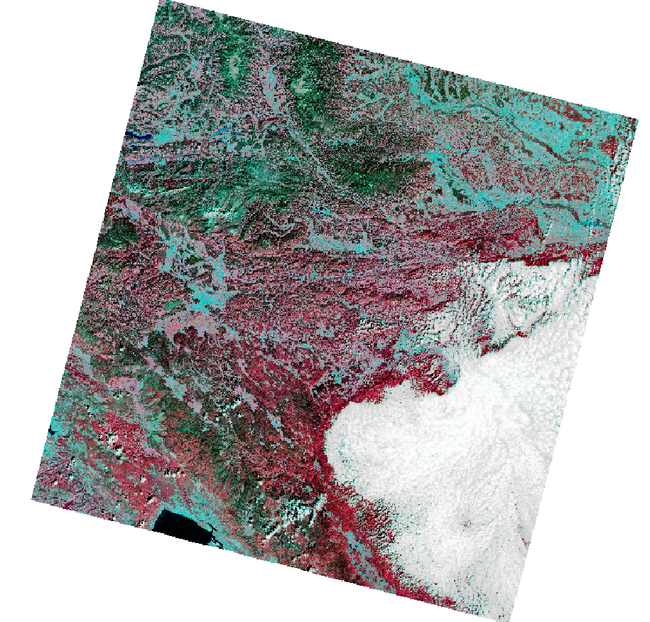

In this image, vegetation now appear in red colors while greenish areas indicate areas without vegetation. Water bodies will appear very dark as most of the electromagnet radiation is absorbed by water in the near-infrared portion of the light while the highest reflection of water occurs in the blue channel which is not  considered in this visualization option.

#### Exercise: Explore visualization settings #####

To practise a bit the so far learned commands, try to load the second image provided in the downloaded data (stored in the folder **Landsat/D310**). Store the second image in a variable named **ls_d310**. Try to play around a bit more with the **plotRGB** command and try out differing visualization settings (for example modify the channels used for plotting and see how the image colors change).

### Step 3: Clipping Landsat data ###

#### Approach 1: Clipping to the maximum extent ####

Quite often our area of interest is smaller than a complete Landsat scene which covers several thousand square kilometers. In this part of the Tutorial, we will hence learn how to clip-out a part of the Landsat scene using a polygon-shapefile.

As first step, we will load the shapefile by executing the following command:
	
	# set wd to shapefile
	setwd("D:/remote_sensing/Landsat/Shape")
	# load Shapefile 
	vec<-readOGR(".","area2")

Executing this commant will result in the following console output:

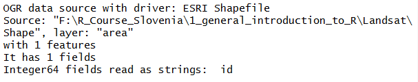

A basic summary of the loaded shapefile can be obtained by simply running its variable name. In our case:

	vec

This will result in the following console output which gives us information about the extent of the loaded Shapefile, the number of features (polygons) and the coordinate reference system:

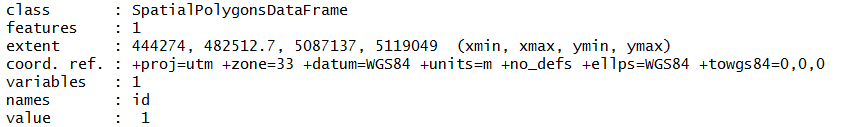

Next, we will plot the shapefile over the Landsat image to see whether the two datasets match and which part of the satellite scene we will clip. This required the following commands:

	plotRGB(ls_d239, r=4, g=3, b=2, stretch="hist")
	plot(vec, add=T, col="red")

and should results in the image below.

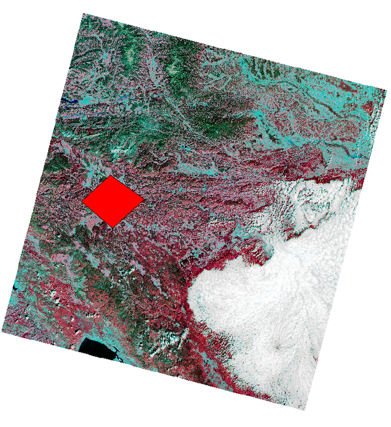

We can now clearly see that the shapefile overlaps with the image and we should hence be able to use it to clip the Landsat dataset.

In this first step, we will use the maximum extent of the shapefile polygon to clip the satellite image. There is also another option to clip the image using the exact shape of the polygon, but we will have a look at this option later.
 
For the first approach, we will first derive the extent of the Shapefile using the command:

	e <- extent(vec)

If we run the variable using

	e

We can see in the console output the maximum extent that is covered by the shapefile.

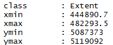

In the next step, we will use this extent-variable to clip the satellite scene:

	setwd("D:/remote_sensing/Landsat/Output")
	ls_d239_clip <- crop(ls_d239, e, filename="ls_d239_clipped.tif", overwrite=TRUE)

This process will now clip the Landsat scene using the extent stored in the variable e and save the clipped image into the variable ls_d239 _clip. Additionally, a new tif-file will be created on the hard-disk and stored into the last defined path (in the example, we switch the folder before running the clip command to control where the clippped files are stored).

After the clipping, we can have a look at the clipped satellite scene using the plotRGB command:

	plotRGB(ls_d239_clip, r=3, g=2, b=1, stretch="hist")

We can now see, that area covered by the clipped satellite scene is a lot smaller than our original scene. On the other hand, more details become visible in the plotted image.

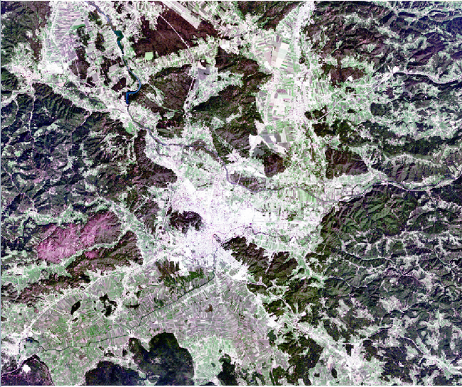

#### Approach 2: Clipping to the exact outline of the Shapefile ####

To clip the raster file to the exact shape of the polygon, only one additional step is required. Basically, the clipping procedure remains the same but after the image has been clipped to the rectangular extent of the shapefile, the remainding pixels that are not located within the polygon are masked out using the **mask** command of the *raster* package. The results in the following code:

	setwd("D:/remote_sensing/Landsat/Output")
	ls_d239_clip2 <- crop(ls_d239, e, overwrite=TRUE)
	ls_d239_clip3 <- mask(ls_d239_clip2, vec)

The masking procedure may take quite a long time depending on the computer's performance. In the end the image should look like this:

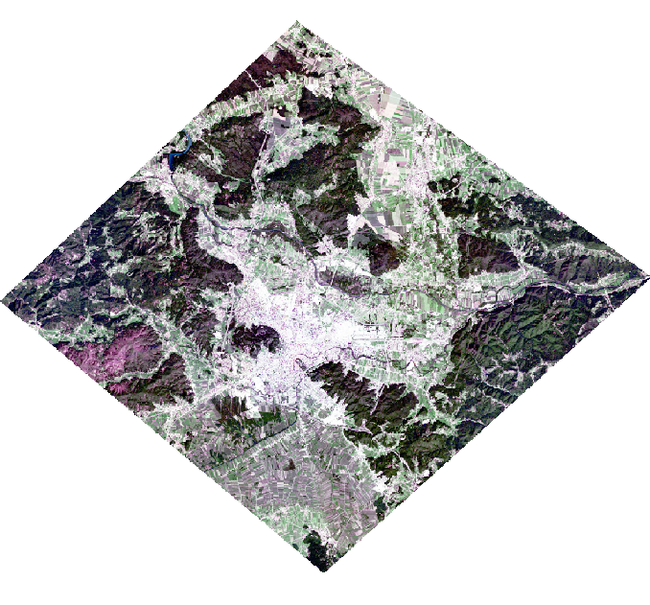

#### Exercise: Clipping #####

To practise the clipping procedure, try to implement the code to also clip the second Landsat image (fromt he folder **D310**) using the same R commands. We will use the clipped version of this second image (which should look like the image below) in the next Step.

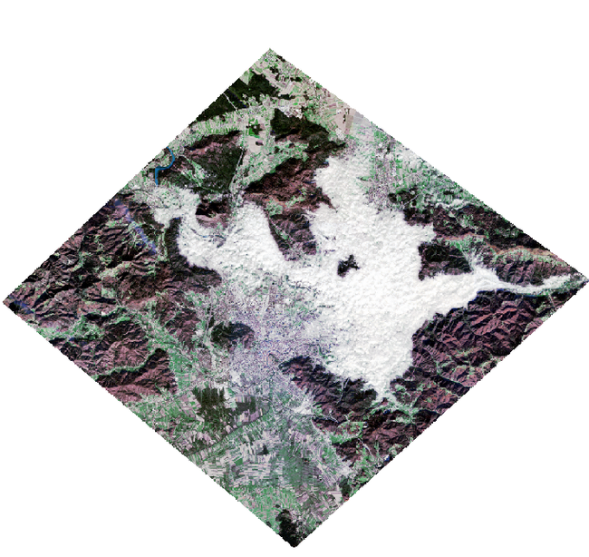

### STEP 4: Applying a cloud mask ###

In this next step, we will make use of the cloud-mask product that is routinely delivered with the Landsat 8 surface reflectance product. The cloud-mask product is currently stored in the folder **Landsat/D310/cl_mask**. As only the second Landsat image (**D310**) is affected by some clouds, we will use this scene as example.

To load the cloud-mask we will use the already familiar code to load a raster image:

	setwd("D:/remote_sensing/Landsat/D310/cl_mask")
	d310_mask <- stack("LC81910282015310LGN00_cfmask.tif")

We can have a look at the just loaded data by plotting the raster using:

	plot(d310_mask)

This leads to the following image:

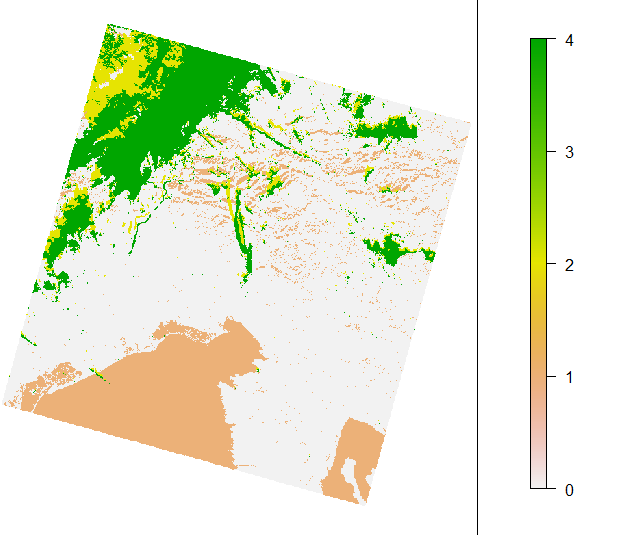

Be aware that it makes no sense to use the **plotRGB** command here, as the cloud-mask raster contains only a single raster layer/channel.

We can see that the cloud-mask layer contains five different values in our case. To understand what each of the 5 classes exactly mean, it is necessary to refer to the Landsat 8 surface reflectance guide (Link provided above).

To make the masking-process more effective, we will now first clip the cloud-mask to the same extent as the already clipped Landsat images. Therefore, we will use the same commands as just learned:

	d310_mask_clip <- crop(d310_mask, e)
	d310_mask_clip2 <- mask(d310_mask_clip, vec)
	plot(d310_mask_clip2)

This should result in the following image:

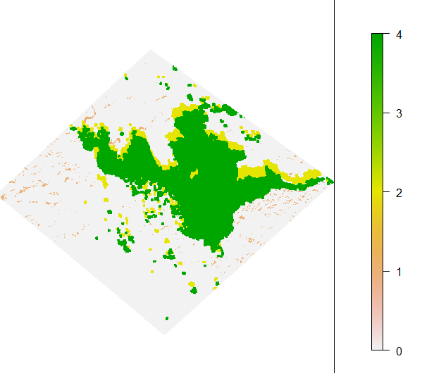

If we compare this to the original image:

we can infer, that the value 3 seems to indicate cloud-cover, value 2 cloud-shadows and value 1 water bodies. Clear pixels are indicated by a value of 0. Please be aware that these values may change depending on the version of the surface reflectance product applied. It is highly recommended to double-check this information in the corresponding product guide.

As next step, we will have to mask our the clouds, or alternatively, all pixels that are neither clear nor water. In this case, we will follow the latter approach. To achieve this, we will first create a binary mask from the cloud-cover layer using the command:

	d310_mask_clip_bin <- d310_mask_clip2 > 1
	plot(d310_mask_clip_bin)

In this new layer, all areas affected by clouds or cloud-cover are now marked with a value of 1 while all pixels being either clear of water bodies have a value of 0.

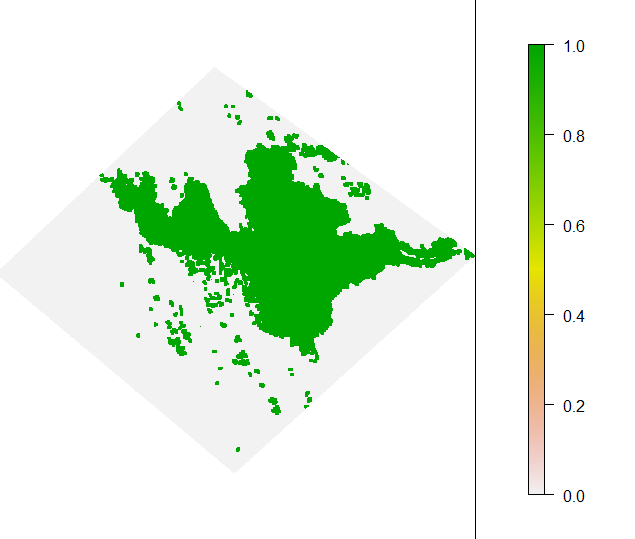

Now, we can apply this mask to the original clipped Landsat image using the following command:

	d310_masked <- mask(ls_d310_clip3, d310_mask_clip_bin, maskvalue=1,  updatevalue=NA)
	plotRGB(d310_masked, r=3, g=2, b=1, stretch="hist")

This will lead to a new version of the Landsat image where all cloud-affected pixels were masked out by replacing all values in the Landsat image with NA (=not available).

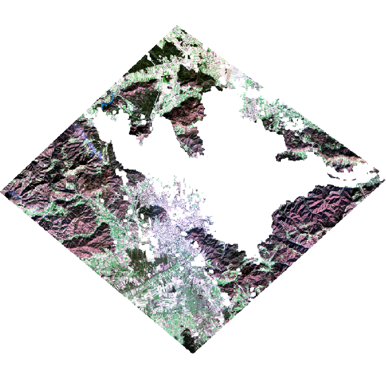

To save this image, we can either define a filename in the **mask()**-function as done before in the **crop()**-function or we can use a separate command:

	writeRaster(d310_masked, filename="Landsat8_D310_cloud_masked.tif", format="GTiff")

We may want to change the current path to an output folder before saving the raster file. You can use the **setwd()**-function to achieve this. 

### STEP 5: Simple change detection using image differencing ###

In this step, we will use simple arithmetic operations to perform a change detection using the two Landsat images. "Change detection" is a general term for a big family of methodical approaches to identify areas in images that have changed from one acquisition date to another. As heard in the theoretical lecture, such changes can be due to various reasons, including phenological changes, land-use or and/or land-cover changes, catastropic events, natural succession, and so on.

#### NIR difference image ####

We will start with the probably simplest change detection approach: Image differencing.

Image differencing bases on the assumption that changes occuring between two image acquisition dates can be identified by simply substracting one image from the other image. Areas that did not change should have very similar reflectance values and the difference image should hence depict a value close to zero.

On the contrary, if changes have occurred, the difference image will depict values that are clearly deviating from zero.

So let us try this with our two Landsat images. One thing we have to consider is that we cannot simply substract a complete image from the other but we should rather work on an individual channel level. Here, we will hence first extract the near-infrared (nir) channel of both images and then substract the second image from the first. To extract the nir channel we use:

	nir_d239 <- ls_d239_clip3[[4]]
	nir_d310 <- d310_masked[[4]]

By using the doubled squared brackets [[]], we can access individual bands of a raster stack. After extracting the nir bands, we can calculate and plot the difference image using:

	nir_diff <- nir_d239 - nir_d310
	plot(nir_diff)

which will result in the following image:

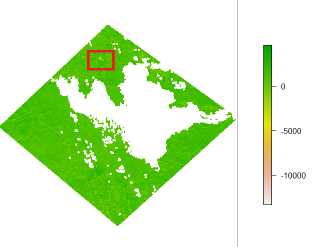

Most of the values of the image are comparably close to zero, as indicated by the greenish colours, however, there are also some parts in the image that show clear changes (see for example the yellow area marked with the red box). A difference of around -5000 is very remarkable as the overall valid value range of the Landsat data lays between 0 and 10000 (10000 indicating a reflectance of 100% which is normally by far not reached by natural surfaces). If we want to make more details visible in the plot, we also have the option to change the plotted range of values and hence increase the contrast for lower vlaues.

We can do this modifying the **plot()**-command to:

	plot(nir_diff, zlim=c(-2000,2000))

By providing user-defined limits for the z-dimension (=pixel values) we can force the plot command to use its full color range to plot values between the given two values. Values lower than -2000 and higher than 2000 will no further be separable. This results in a new plot which looks like this:

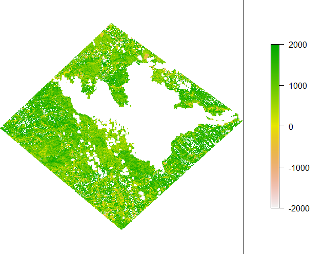

It now becomes clear that actually quite many areas showed a notable difference between the first and second image as now shown by the green colors which indicate a positive difference in most areas. This seems to be a plausible result as most of our satellite scene is dominated by vegetation and the first image's acquisition date was day 239 = 27th of August (late summer) and second image's acquisition date was day 310 = 6th of November (autumn). Hence, the reduction of reflectance in the nir channel is most likely connected to the senescence of the leaves of most parts of the vegetation which most likely began shortly after the first image was acquired.

#### NDVI difference image #####

We will now further verify these results by repeating the analysis but replacing the nir channels with normalized difference vegetation index (NDVI) images. The NDVI is probably the most famous metric obtained from optical remote sensing data that is frequently used as a general measure of photosynthetic activity / vegetation abundance. The NDVI is often also referred to as a "Vegetation Index". More information about the NDVI can for example be found under the following links:

[https://en.wikipedia.org/wiki/Normalized_difference_vegetation_index](https://en.wikipedia.org/wiki/Normalized_difference_vegetation_index)

[https://earthobservatory.nasa.gov/Features/MeasuringVegetation/measuring_vegetation_2.php](https://earthobservatory.nasa.gov/Features/MeasuringVegetation/measuring_vegetation_2.php)

One important information given in both articles found via the links is the formula to calculate the NDVI. The formula is defined as:

NDVI = (**Refl** NIR - **Refl** RED) / (**Refl** NIR + **Refl** RED)

These kind of equations are referred to as "normalized differences". One key-advantage of these normalized differences is that the value range of vegetation indices calculated in these manners are standardized between -1 and 1. 

To calculate NDVIs from our Landsat images we execute the following code:

	ndvi_d239 <- (ls_d239_clip3[[4]]-ls_d239_clip3[[3]])/(ls_d239_clip3[[4]]+ls_d239_clip3[[3]])
	ndvi_d310 <- (d310_masked[[4]]-d310_masked[[3]])/(d310_masked[[4]]+d310_masked[[3]])

Then we can have a look at the two NDVI images - we again adapt the z-lim range and furthermore add a new command to plot the two plots side-by-side:

	par(mfrow=c(1,2))
	plot(ndvi_d239, zlim=c(-0.5,1), main="Day 239")
	plot(ndvi_d310, zlim=c(-0.5,1), main="Day 310")

This will result in the following plot:

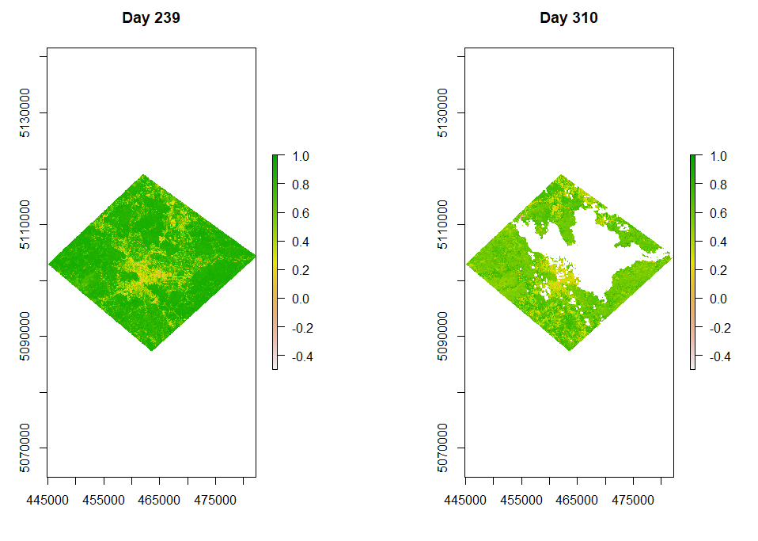

We can now calculate and plot the NDVI difference image by running:

	ndvi_diff <- ndvi_d239 - ndvi_d310
	plot(ndvi_diff)

which will result in the following plot:

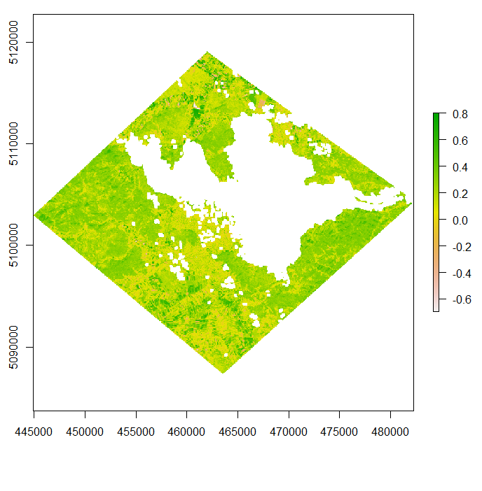

As a final step, we will now identify areas that show a very high NDVI difference by applying a threshold. That is, we will build a binary mask in which all areas that have a NDVI difference > 0.5 will be displayed as 1 and all other values as 0. In this case, we will use the **abs()**-function (returning absolute values) to consider both negative and positive differences. We run the following code:

	ndvi_gt_0_5 <- abs(diff_ndvi) > 0.5 
	plot(ndvi_gt_0_5)

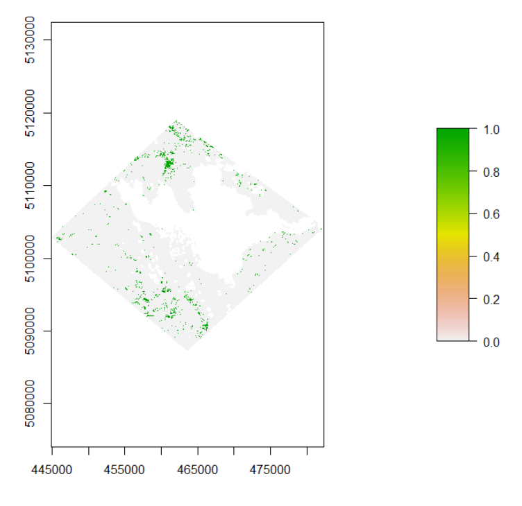

In this image, the grey areas have a NDVI difference smaller than 0.5 while the green areas have NDVI differences that are higher than 0.5. The white areas refer to the NAs in the second image due to cloud-cover.

### STEP 5: Unsupervised classification ###

As last part of this first Tutorial, we will apply an unsupervised classification to one of the Landsat scenes. An unsupervised classification is sometimes also referred to a clustering process and attempts to sort the observations of a dataset into meaningful classes. The number of classes is normally user-defined and can either be a fixed number or a range with a defined minimum and maximum number of classes. In our case, we will apply a very common algorithm called k-means.

The function is called **kmeans()** in R and was originally not developed to particularly work with raster data. However, there is a small work-around so that we can still apply it to our datasets. This work-around bases on a transformation of our raster-dataset to a dataframe (a table). Then the kmeans-algorithm is applied to the table, and the results of the clustering are re-transformed to a raster dataset.

Let's start by trying to run the following code:

	class1 <- kmeans(as.data.frame(d239_masked), 12, iter.max = 10, nstart = 10)

The code will convert the raster-object to a data.frame and then run the kmeans-algorithm to classify all pixel-values into 12 classes. This attempt will result in an error message:

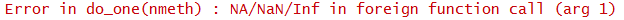

The reason for this is, that our raster data contains some NA values (the areas we masked out before). We can verify that our dataset contains NA values by running the following command:

	table(is.na(values(d239_masked)))

This command is a nested command, we use the **values()**-function to access only the pixel values of the raster-dataset (and ignore the other properties of the raster object), then we apply the **is.na()** function to check for each raster value whether it is NA or not. Finally, we use the **table()**-function to translate the output of the **is.na()**-function (which is table with as many entries as the raster dataset has pixels) into a contingency table that returns to counts of each factor level (in this case there are only two differing values/factors: TRUE and FALSE). The console output looks like this:

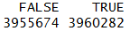

So we now know, that the NAs are problematic for the kmeeans algorithm. We will hence remove them from our dataset. As first step, we will copy our image into a new variable to not change the original image. This can be achieved using the code:

	d239_masked_no_na <- d239_masked

Then we replace all NA values of the image with the value 99999 by running:

	d239_masked_no_na[is.na(d239_masked_no_na)] <- 99999

After running this code, we can recheck the NA situation:

	table(is.na(values(d239_masked_no_na)))

This will return:

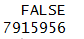

Hence, we have cleaned the dataset from all NA values. We will now try to re-run the kmeans-algorithm by executing:

	class1 <- kmeans(as.data.frame(d239_masked_no_na), 12, iter.max = 10, nstart = 10)

This time, no error message will occur. It could be that some warning messages are printed, but we will ignore these for now. After the kmeans-algorithm is completed, we will have a new object called **class1**. We can have a closer look at the structure of this oject using:

	str(class1)

This will return the following console output:

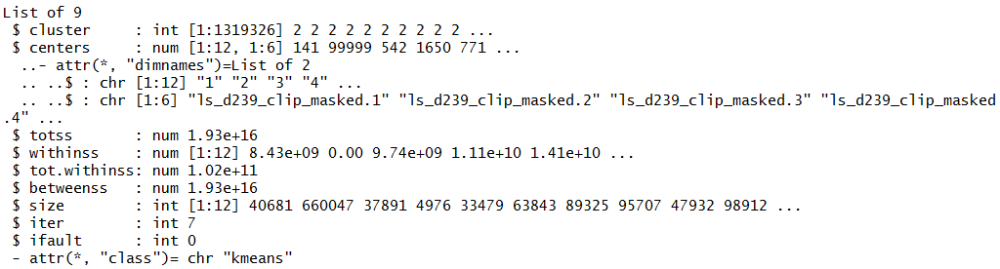

For us particularly interesting are the entries **cluster** and **centers**. The former contains our classification results, that is, the id of the cluster to which each pixel has been assigned to. On the other hand, the **centers** entry contains more detailed information about the individual clusters by providing information about the center-value for each band of the image. That is why this entry has 12 rows (12 clusters) and 6 columns (the six Landsat bands).

We can access the individual entries of the classification object by running for example:

	class1$centers

which will return the just described table with 12 rows and 6 columns:

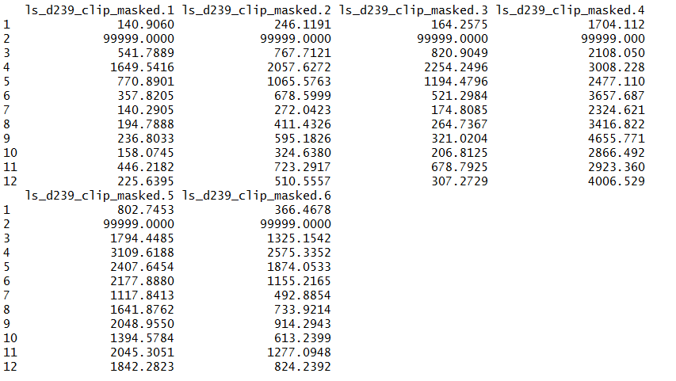

The values from your own run, are likely to deviate from the ones you can see depicted here as the kmeans-algorithm contains a random component. That means, each run of the kmeans-algorithm will result in a slightly differing outcome. This can be addressed by using the **set.seed()**-function. But this will be discussed with more details in a later Tutorial.

As next step, we will now retransform the classification results of the kmeans-algorithm to a raster image. The easiest way to do this is to overwrite the values of a band from the original image. We can achieve this by first copying a band of the original image into a new variable:

	class1_out <- d239_masked[[1]]

And then overwriting the values of this band with the clustering results:

	values(class1_out) <- class1$cluster
	plot(class1_out)

The result is a new raster image indicating the cluster id (cluster 1- cluster 12) of each pixel:

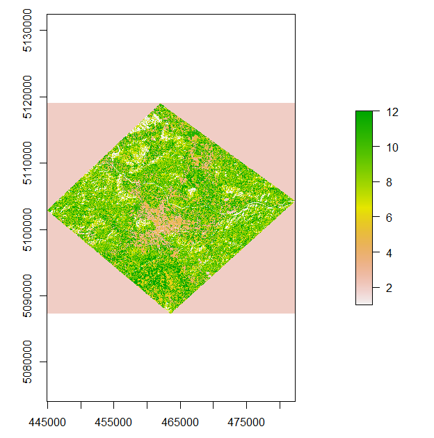	

We can now save this raster file using:

	writeRaster(class1_out,"12_classes_ls5.tif", overwrite=TRUE)

As next step, we can open the original image as well as the results of the unsupervised classification in QGIS and examine whether we can allocate the individual clusters to land-cover types.
